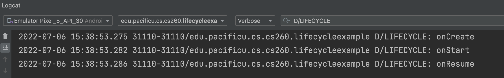

# AndroidLifecycleExample

### To run in Android Studio

* Run the App in the Emulator
* Close the App 
  * Switcher Button (Square) on Emulator Navigation Bar, slide up
* Put the Lifecycle Example App on the Emulator main screen.
  * Drag up from the botton of the emulator screen
  * Click and Hold the Lifecycle App icon
  * While holding the mouse button, drag the icon up on the main screen.
* Open Logcat:
  * View | Tool Windows | Log Cat
* Filter Logcat messages:
  * Message Level Dropdown: Debug
  * Search Box: D/LIFECYCLE
* Run App on the Emulator
  * You should see onCreate(), onStart(), onResume() in Logcat

### Common Problems

* Make sure Logcat is connected to the correct Emulator (not a previous run)
* Make sure Logcat is connected to the correct, live process on the Emulator

### Exercises:

1. Press Home Button (Circle) in Navigation Bar
  * Which methods are called?
2. Open the app again by clicking on the icon
  * Which methods are called?
3. Press the Back Button (Triangle) on the Navigation Bar
  * Which methods are called?
4. Open the app again by clicking on the icon
  * Which methods are called?
4. Press the Switcher Button (Square)
  * Which methods are called?
5. Click the app window to bring it back to focus.
  * Which methods are called?
6. Press the Switcher Button (Square)
  * Which methods are called?
7. Swipe up to kill the app.
  * Which methods are called?
